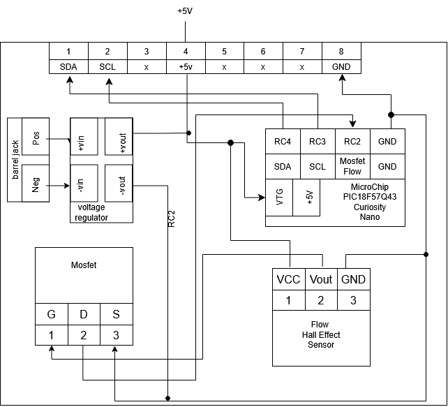

## Overview
The following block diagram describes the flow sensing subsystem I was responsible for. The board's purpose is to provide a status of whether or not water is flowing through the system. This device runs solely from +5v dc with two options for power: barrel jack or +5v from main voltage bus. This board makes use of a hall effect sensor that triggers the gate of a mosfet. The drain is then connected to a CCP pin of the PIC18. My board is a "slave" board that communicates with the "master" board.

## Example Block Diagram 
